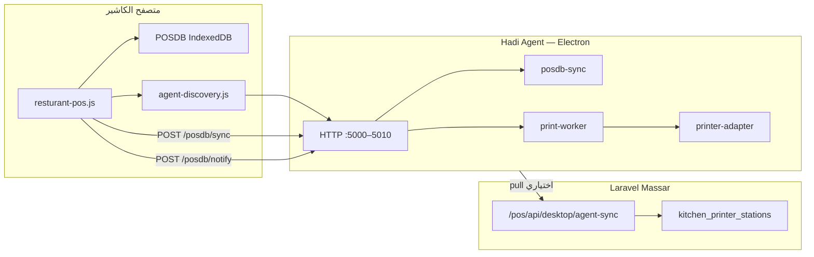

# توثيق طباعة POS — Massar + Hadi Agent

> آخر تحديث: مايو 2026  
> الإصدار: Hadi Agent 1.2.0 — وضع `posdb-sync`

---

## 1. نظرة عامة

نظام طباعة المطعم يعمل **offline-first**:

1. الكاشير يحفظ الفاتورة في **POSDB** (IndexedDB داخل Chrome/Edge).
2. المتصفح يرسل أوامر الطباعة إلى **Hadi Agent** (تطبيق Electron على نفس الجهاز).
3. الـ Agent يطبع **صامتاً** على طابعات Windows حسب المجموعة (مطبخ) والكاشير.



### قاعدة مهمة

| التخزين | أين | من يقرأه |
|---------|-----|----------|
| `POSDB` في Chrome | IndexedDB المتصفح | الكاشير + مزامنة للـ Agent |
| `posdb-sync` في Agent | ذاكرة العملية | التشخيص + print-worker |
| MySQL | `kitchen_printer_stations` | Massar + سحب Agent |

**IndexedDB في Electron ≠ IndexedDB في Chrome** — لذلك لا يعتمد الـ Agent على قراءة POSDB من Electron إلا كاحتياطي؛ المصدر الأساسي هو **المزامنة من المتصفح** أو **السحب من Massar**.

---

## 2. المكونات

### 2.1 Massar (Laravel)

| الملف | الدور |
|-------|------|
| `Modules/POS/app/Services/POSService.php` | `categoriesData`, `hadiAgentUrl`, إعدادات الطباعة |
| `Modules/POS/app/Http/Controllers/POSController.php` | `getDesktopAgentSync()` — سحب مجموعات + print_config |
| `Modules/POS/app/Http/Controllers/CategoryPrinterController.php` | ربط مجموعة ↔ طابعة |
| `Modules/POS/config/kitchen-printer.php` | إعدادات URL/Token/نطاق المنافذ |
| `public/modules/pos/js/resturant-pos.js` | شاشة المطعم — حفظ + أوامر طباعة |
| `public/modules/pos/js/pos-indexeddb.js` | POSDB v7 |
| `public/modules/pos/js/agent-discovery.js` | اكتشاف منفذ Agent ديناميكياً |

### 2.2 Hadi Agent (Electron)

| الملف | الدور |
|-------|------|
| `main.js` | تشغيل، single-instance، منفذ ديناميكي |
| `src/local-server.js` | HTTP: `/health`, `/posdb/sync`, `/posdb/notify` |
| `src/posdb-sync.js` | كاش المجموعات + print_config من المتصفح |
| `src/pos-pull-sync.js` | سحب من Massar API |
| `src/print-worker.js` | معالجة `print_jobs` + طباعة فورية |
| `src/printer-adapter.js` | طباعة صامتة عبر `webContents.print` |
| `src/port-utils.js` | منافذ ديناميكية + اكتشاف |
| `src/posdb-repository.js` | قراءة Electron IDB (احتياطي) |

---

## 3. تدفق الطباعة (خطوة بخطوة)

### عند فتح `/pos/restaurant`

1. `rDb.open()` — ترقية POSDB إن لزم.
2. `saveCategories(CFG.categoriesData)` + `savePrintConfig(...)`.
3. `HadiAgentDiscovery.discoverAgentUrl()` — مسح منافذ 5000–5010.
4. `POST /posdb/sync` — إرسال `categories` + `print_config` للـ Agent.

### عند حفظ فاتورة (`saveRPosInvoice`)

1. `buildInvoiceData()` — عناصر السلة مع `category_id`.
2. `buildPrintJobs(data)` — إنشاء سجلات في `print_jobs`:
   - `kitchen` — لكل مجموعة لها `printer_name`.
   - `cashier` — إذا `print_requested && print_silent`.
3. `saveTransaction` + `savePrintJobs`.
4. `POST /posdb/notify` مع `{ transaction, print_jobs }`.
5. Agent ينفّذ `processPrintJobs` ويرجع `{ jobs: [{ id, status, error_message }] }`.
6. المتصفح يحدّث حالة كل job في POSDB.

---

## 4. POSDB (IndexedDB) — الإصدار 7

**اسم القاعدة:** `POSDB`  
**الملف:** `public/modules/pos/js/pos-indexeddb.js`

| Store | المفتاح | المحتوى |
|-------|---------|---------|
| `items` | `id` | أصناف |
| `categories` | `id` | مجموعات + `printer_name` |
| `transactions` | `local_id` | فواتير + `sync_status`, `print_status` |
| `print_config` | `id` = `main` | إعدادات طباعة للـ Agent |
| `print_jobs` | `id` (UUID) | أوامر طباعة فردية |
| `held_orders` | `local_id` | طلبات معلّقة |
| `customers` | `local_id` | عملاء |
| `payouts` | `local_id` | مصروفات |

### هيكل `print_jobs`

```javascript
{
  id: "uuid",
  transaction_local_id: "uuid",
  job_type: "kitchen" | "cashier",
  category_id: "8",           // null للكاشير
  category_name: "مشويات",
  printer_name: "Xprinter XP-233B",  // اسم Windows بالظبط
  items: [ /* عناصر المجموعة */ ],
  status: "pending" | "printed" | "failed" | "skipped",
  error_message: null | "no_printer_for_category",
  created_at: "ISO8601",
  printed_at: null | "ISO8601"
}
```

### حالات `status`

| الحالة | المعنى |
|--------|--------|
| `pending` | في انتظار Agent |
| `printed` | تمت الطباعة بنجاح |
| `skipped` | لا طابعة معيّنة للمجموعة |
| `failed` | فشل (طابعة غلط، timeout، إلخ) |

---

## 5. واجهة HTTP — Hadi Agent

**الاستماع:** `127.0.0.1` — منفذ ديناميكي (افتراضي 5000–5010)  
**CORS:** مفتوح للمتصفح المحلي

### المصادقة (اختياري)

إذا `agentToken` / `HADI_AGENT_TOKEN` مضبوط:

```
X-Desktop-Token: <token>
```

أو:

```
Authorization: Bearer <token>
```

### `GET /health`

```json
{
  "status": "ok",
  "version": "1.2.0",
  "mode": "posdb-sync",
  "port": 5001,
  "url": "http://127.0.0.1:5001",
  "categories": 11,
  "synced_at": "2026-05-19T...",
  "token_required": true
}
```

### `POST /posdb/sync`

**Body:**

```json
{
  "categories": [
    { "id": 8, "name": "مشويات", "printer_name": "Xprinter XP-233B" }
  ],
  "print_config": {
    "enable_print": true,
    "silent_print": true,
    "enable_kitchen_print": true,
    "direct_printer_name": "Xprinter XP-233B",
    "kitchen_title": "طلب مطبخ",
    "cashier_title": "فاتورة مبيعات"
  }
}
```

### `POST /posdb/notify`

**Body:**

```json
{
  "local_id": "transaction-uuid",
  "transaction": { /* snapshot كامل */ },
  "print_jobs": [ /* من buildPrintJobs */ ]
}
```

**Response:**

```json
{
  "success": true,
  "port": 5001,
  "jobs": [
    { "id": "job-uuid", "status": "printed", "error_message": null }
  ]
}
```

---

## 6. واجهة Massar — سحب Agent

```
GET /pos/api/desktop/agent-sync
Header: X-Desktop-Token: <HADI_AGENT_TOKEN>
```

**Response:**

```json
{
  "categories": [ ... ],
  "print_config": { ... }
}
```

يُستدعى تلقائياً عند تشغيل Agent وكل دقيقتين (احتياطي إذا المتصفح لم يزامن).

---

## 7. الإعداد

### 7.1 `.env` (Massar)

```env
# عنوان Agent — اختياري؛ المتصفح يكتشف المنفذ تلقائياً 5000–5010
HADI_AGENT_URL=http://127.0.0.1:5000

# نفس القيمة في Agent → الإعدادات → Token
HADI_AGENT_TOKEN=your-secret-token

HADI_AGENT_PORT_MIN=5000
HADI_AGENT_PORT_MAX=5010
```

### 7.2 إعدادات Agent (واجهة ⚙)

| الحقل | مثال | ملاحظة |
|-------|------|--------|
| رابط Massar | `http://127.0.0.1:8080` | بدون `/pos/restaurant` |
| Token | نفس `.env` | لمزامنة السحب + حماية HTTP |

يُحفظ في: `%APPDATA%/hadi-agent/config.json` (أو مسار `userData` لـ Electron)

```json
{
  "serverUrl": "http://127.0.0.1:8080",
  "agentToken": "...",
  "agentPort": 5001,
  "enableLocalPrinting": true
}
```

### 7.3 أسماء الطابعات

يجب أن تطابق **بالظبط** اسم الطابعة في Windows (من التشخيص → طابعات Windows):

- ✅ `Xprinter XP-233B`
- ❌ `test`, `CLASS`, `طابعة 1`

---

## 8. تشغيل التطوير

```bash
cd hadi-agent
npm install
npm run kill-port    # تحرير 5000–5010
npm start            # يقتل المنفذ ثم يشغّل Electron
```

```bash
# Massar
php artisan serve --port=8080
# افتح: http://127.0.0.1:8080/pos/restaurant
```

### أوامر npm

| الأمر | الوظيفة |
|-------|---------|
| `npm start` | kill-port + Electron |
| `npm run kill-port` | إنهاء عمليات على 5000–5010 |
| `npm run build` | مثبّت Windows |

---

## 9. محرك الطباعة

**الملف:** `src/printer-adapter.js`

- يكتب HTML مؤقت في `%TEMP%`.
- ينشئ `BrowserWindow` مخفي.
- `webContents.print({ silent: true, deviceName: printerName })`.

> **لا تستخدم** `Start-Process -Verb PrintTo` لملفات HTML — غير مدعوم على Windows.

---

## 10. اكتشاف المنفذ (المتصفح)

**الملف:** `public/modules/pos/js/agent-discovery.js`

1. يجرب `CFG.hadiAgentUrl` إن كان على `127.0.0.1`.
2. يمسح `5000` → `5010` عبر `GET /health`.
3. يخزّن النتيجة في `sessionStorage` لمدة 30 ثانية.

```javascript
const url = await HadiAgentDiscovery.discoverAgentUrl({
  hadiAgentUrl: CFG.hadiAgentUrl,
  hadiAgentToken: CFG.hadiAgentToken,
  portMin: 5000,
  portMax: 5010,
});
```

---

## 11. التشخيص

من واجهة Agent → **تشخيص**:

| الفحص | معناه |
|-------|--------|
| رابط Massar | لسحب المجموعات |
| Token | مطابقة `.env` |
| خادم Agent (ديناميكي) | المنفذ الفعلي |
| سحب من Massar | بديل عن مزامنة المتصفح |
| POSDB — المجموعات | من `posdb-sync` |
| طابعة الكاشير | `direct_printer_name` |
| طابعات Windows | قائمة الأسماء الصحيحة |

في Chrome: **F12 → Application → IndexedDB → POSDB → print_jobs** لمراجعة أوامر الطباعة.

---

## 12. استكشاف الأخطاء

| العرض | السبب | الحل |
|-------|-------|------|
| `EADDRINUSE` | نسختان من Agent | `npm run kill-port` ثم `npm start` مرة واحدة |
| POSDB مجموعات ❌ | لم تُزامَن | افتح شاشة المطعم أو أعد التشخيص |
| `token_unauthorized` | Token غير متطابق | طابق Agent و `.env` |
| `Start-Process` / PrintTo | كود قديم | تأكد من `printer-adapter.js` الجديد |
| `print failed on "test"` | اسم طابعة غلط | استخدم اسم Windows الحقيقي |
| `skipped` / `no_printer_for_category` | مجموعة بدون طابعة | إعدادات الطباعة → مجموعات |
| لا طباعة كاشير | لم تفعّل طباعة صامتة | حفظ + ✓ طباعة مباشرة |

---

## 13. مسارات التطوير المستقبلي

- [ ] واجهة في Agent لعرض `print_jobs` الأخيرة من المتصفح (عبر API جديد).
- [ ] إعادة محاولة تلقائية للـ `failed` jobs.
- [ ] طباعة ESC/POS خام (بدون HTML) لطابعات محددة.
- [ ] تعطيل مسار Laravel Queue القديم (`PrintKitchenOrderJob`) لتجنب تكرار الطباعة.
- [ ] مزامنة `print_jobs` عبر WebSocket بدل polling.

---

## 14. خريطة الملفات (مرجع سريع)

```
hadi-agent/
├── main.js
├── preload.js
├── package.json
├── docs/POS-PRINTING.md          ← هذا الملف
├── scripts/kill-port-5000.js
└── src/
    ├── local-server.js
    ├── posdb-sync.js
    ├── pos-pull-sync.js
    ├── print-worker.js
    ├── printer-adapter.js
    ├── printer-service.js
    ├── posdb-repository.js
    ├── port-utils.js
    ├── url-utils.js
    └── ipc-handlers.js

public/modules/pos/js/
├── pos-indexeddb.js      # v7 + print_jobs
├── resturant-pos.js
└── agent-discovery.js

Modules/POS/
├── config/kitchen-printer.php
├── app/Services/POSService.php
├── app/Http/Controllers/POSController.php
└── resources/views/restaurant.blade.php
```

---

## 15. سجل التغييرات الرئيسية

| التاريخ | التغيير |
|---------|---------|
| 2026-05 | مزامنة browser → Agent (`posdb-sync`) |
| 2026-05 | جدول `print_jobs` في POSDB v7 |
| 2026-05 | منفذ ديناميكي 5000–5010 |
| 2026-05 | طباعة Electron بدل PowerShell PrintTo |
| 2026-05 | `GET /pos/api/desktop/agent-sync` |
